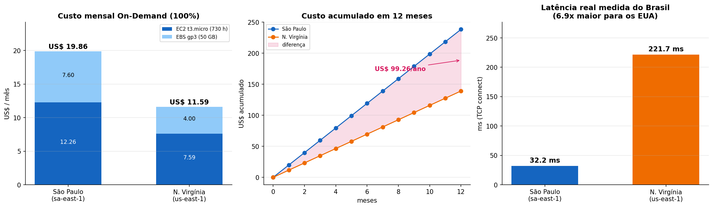
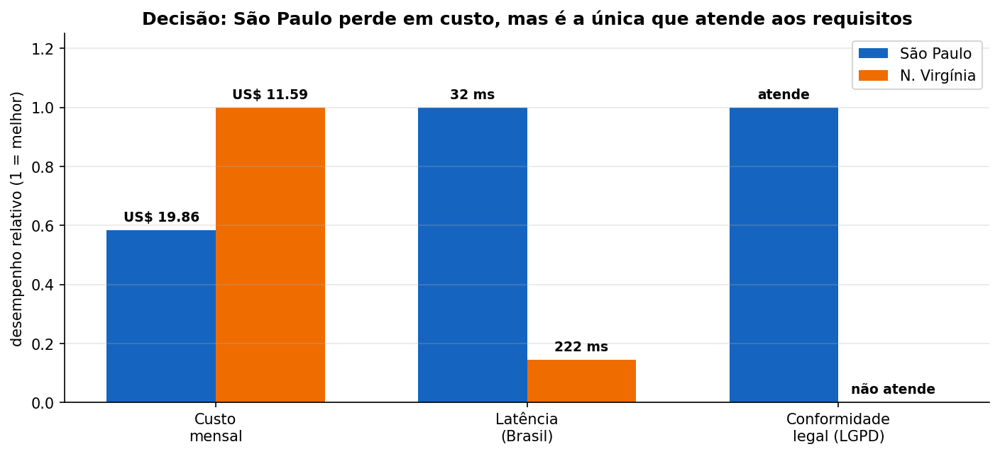

# FIAP - Faculdade de Informática e Administração Paulista

<p align="center">
<a href="https://www.fiap.com.br/"></a>
</p>

<br>

# FarmTech Solutions — Previsão de Rendimento de Safra
### PBL Fase 5 · Entrega 1 (Machine Learning) + Entrega 2 (Computação em Nuvem)

---

## 👨‍🎓 Integrante

- [Gustavo do Carmo Kamitani](https://www.linkedin.com/in/gustavo-kamitani/) — RM569284

## 👩‍🏫 Professores

### Tutor(a)
- *(preencher)*

### Coordenador(a)
- André Godoi Chiovato

---

## 📽️ Vídeos de Apresentação

| Entrega | Conteúdo | Link |
|---|---|---|
| 1 | Demonstração do notebook (Machine Learning) | 🎬 **[inserir link — YouTube, não listado, até 5 min]** |
| 2 | Comparação de recursos na calculadora AWS | 🎬 **[inserir link — YouTube, não listado, até 5 min]** |

---

## 📌 Sobre o projeto

A FarmTech Solutions presta serviços de IA para uma fazenda de médio porte (~200 hectares) que
produz quatro culturas. A partir de uma base com condições climáticas e o rendimento obtido, o
trabalho responde a duas perguntas:

| Pergunta | Abordagem | Capítulo |
|---|---|---|
| Que **tendências** e **cenários discrepantes** existem na produtividade? | Não supervisionado — K-Means, DBSCAN, PCA, detecção de outliers | Cap. 10 (Fase 5) |
| É possível **prever** o rendimento a partir das condições? | Supervisionado — 5 algoritmos de regressão | Cap. 13 (Fase 4) |

Todo o desenvolvimento está no notebook **[`GustavoKamitani_rm569284_pbl_fase4.ipynb`](GustavoKamitani_rm569284_pbl_fase4.ipynb)**, com as células já executadas.

---

## 🔎 Principais achados

O resultado mais importante deste trabalho **não é o R² de 0,98** — é a demonstração de que esse
número não significa o que parece.

**1. A base é um painel replicado.** São 156 registros = **39 observações climáticas idênticas
repetidas para 4 culturas** (Cocoa, Oil palm, Rice, Rubber). O número de observações realmente
independentes é 39, não 156.

**2. A cultura explica quase tudo.** As faixas de rendimento são disjuntas e a razão entre a maior
e a menor média passa de 20×. A correlação global do clima com o rendimento é ≈ 0 — não porque o
clima seja irrelevante, mas por efeito de mistura entre grupos de patamares muito diferentes.

**3. Auditoria do R² — de onde vem o desempenho:**

| Variáveis usadas | R² (CV) — Reg. Linear | R² (CV) — Random Forest |
|---|---|---|
| só cultura | 0,9871 | 0,9871 |
| só clima | −0,0720 | **−0,7538** |
| completo | 0,9870 | 0,9879 |

Acrescentar as quatro variáveis climáticas à cultura muda o R² em **+0,0008**. O clima sozinho
prevê **pior do que chutar a média**.

**4. Prevendo dentro de cada cultura (a pergunta que o produtor faz de verdade):**

| Cultura | R² (Reg. Linear) | R² (Random Forest) | MAPE |
|---|---|---|---|
| Cocoa, beans | −0,206 | −0,349 | ~16–17% |
| Oil palm fruit | −0,487 | −0,280 | ~7–8% |
| Rice, paddy | −0,129 | −0,007 | ~9% |
| Rubber, natural | −0,031 | +0,030 | ~15% |

Todos nulos ou negativos. Nem o arroz — que apresentava correlação de **0,70** com a umidade
específica dentro da amostra — mantém poder preditivo na validação cruzada. É um caso didático de
correlação que **não generaliza**: com 39 observações, correlações moderadas surgem por acaso.

**5. Clusterização.** Com clima + rendimento, o K-Means **não** reencontra as culturas
(ARI = 0,15). A causa é geométrica: padronizadas, 4 das 5 dimensões são climáticas e dominam a
distância euclidiana, abafando o rendimento. Clusterizando só pelo rendimento o ARI sobe para
0,62 — e ainda assim **Cocoa e Rubber são inseparáveis**, porque suas produções médias quase
coincidem (8.883 e 7.825 hg/ha).

**6. Cenários discrepantes — os critérios discordam, e isso é informativo:**

| Critério | Resultado | Leitura |
|---|---|---|
| IQR na base inteira | marca os registros de dendê | mede a escala da cultura, não a safra atípica |
| IQR dentro da cultura | **0 outliers** | nenhum ano extrapolou a cerca de Tukey da própria cultura |
| Ruído do DBSCAN | **49 registros (31,4%)** | combinações climáticas raras, mesmo com rendimento normal |

Não há safras com rendimento anômalo, mas há muitos anos com **combinação climática incomum** —
coisas diferentes, e só o critério multivariado enxerga a segunda.

**7. Tendência com valor prático.** Os três regimes climáticos identificados deslocam o rendimento
de **arroz e seringueira em até ~24%**, sem efeito relevante sobre cacau e dendê.

### Conclusão

O modelo entregue prevê bem **qual é o patamar de cada cultura** e não prevê **a variação de uma
safra para outra**. Elevar esse teto depende de dados que a base não tem (solo, manejo, série
temporal), não de trocar de algoritmo.

---

## 📁 Estrutura do repositório

```
.
├── GustavoKamitani_rm569284_pbl_fase4.ipynb   # notebook principal (células executadas)
├── data/
│   ├── crop_yield.csv     # base da Entrega 1 (portal FIAP)
│   ├── mall.csv           # exercício do Cap. 10 — K-Means (apêndice 9.1)
│   └── moons.csv          # exercício do Cap. 10 — DBSCAN (apêndice 9.2)
├── assets/                # gráficos da Entrega 2 (AWS)
├── requirements.txt
└── README.md
```

---

## ▶️ Como executar

```bash
python -m venv .venv
# Windows
.venv\Scripts\activate
# Linux / macOS
source .venv/bin/activate

pip install -r requirements.txt
jupyter notebook GustavoKamitani_rm569284_pbl_fase4.ipynb
```

O notebook usa `RANDOM_STATE = 42` em todas as etapas com aleatoriedade (split, K-Means, DBSCAN,
Random Forest, Gradient Boosting), então **a execução é reprodutível** — os números desta página
são obtidos novamente a cada rodada.

Executado com Python 3.13, pandas 3.0.3, scikit-learn 1.8.0.

---

## 🧭 Roteiro do notebook

| Seção | Conteúdo |
|---|---|
| 1 | Configuração do ambiente e semente de reprodutibilidade |
| 2 | Carga e padronização das colunas (aceita as grafias PT e EN) |
| 3 | Análise exploratória — qualidade, estrutura da base, distribuições, correlações global × intragrupo |
| 4 | Cenários discrepantes — IQR, z-score, global × dentro da cultura |
| 5 | Clusterização — K-Means em dois cenários, PCA, DBSCAN, investigação do ARI baixo |
| 6 | Modelagem — 5 algoritmos, validação cruzada, `GridSearchCV` |
| 7 | Avaliação final, **auditoria do R²**, previsão intracultura, resíduos, importância por permutação |
| 8 | Conclusões, pontos fortes e limitações |
| 9 | Apêndice — exercícios do Cap. 10 (`mall.csv` e `moons.csv`) |

---

## 🛠️ Boas práticas aplicadas

- Pré-processamento inteiramente dentro de `Pipeline` — `StandardScaler` e `OneHotEncoder` são
  ajustados **só** com os dados de treino em cada dobra, eliminando *data leakage*.
- Split estratificado por cultura (essencial com apenas 39 registros por cultura).
- Conjunto de teste isolado do início ao fim, usado uma única vez.
- Comparação por validação cruzada de 5 dobras, com `DummyRegressor` como piso de referência.
- Métricas múltiplas: R², RMSE, MAE e MAPE — o MAPE é o único que permite comparar culturas de
  patamares diferentes.
- Diagnóstico de resíduos (dispersão, histograma, Q-Q plot) e importância por permutação.
- Auditoria explícita da origem do R², em vez de reportar a métrica global sem contexto.

---

## ⚠️ Notas sobre os dados

**Unidade do rendimento.** O enunciado descreve o rendimento em *toneladas por hectare*, mas os
valores da base chegam a 203.399 — impossível nessa unidade. A ordem de grandeza corresponde a
**hg/ha** (hectograma por hectare), padrão das bases da FAO: 203.399 hg/ha = 20,3 t/ha, plausível
para dendê. Não afeta a modelagem (é fator de escala constante), mas afeta a leitura das métricas:
um RMSE de 8.544 equivale a ~0,85 t/ha.

**Nome do arquivo.** O enunciado exige que o nome contenha nome completo, RM e `pbl_fase4.ipynb`
(exemplo dado: `JoaoSantos_rm76332_pbl_fase4.ipynb`) — mantendo `fase4` embora a atividade seja da
Fase 5. O nome foi seguido à risca: `GustavoKamitani_rm569284_pbl_fase4.ipynb`.

---

# ☁️ Entrega 2 — Computação em Nuvem (AWS)

> 🎬 **[inserir aqui o link do 2º vídeo — comparação na calculadora AWS, YouTube não listado, até 5 minutos]**

O modelo da Entrega 1 precisa ser hospedado em nuvem, atrás de uma API que receberá os dados dos
sensores que medem precipitação, umidade e temperatura.

## 🖥️ Instância escolhida: `t3.micro`

O enunciado especifica 2 CPUs, 1 GiB de memória, até 5 Gigabit de rede e 50 GB de armazenamento.
A menor instância que atende **exatamente** a esse perfil é a **t3.micro** — as especificações
abaixo vêm do próprio catálogo de preços da AWS, não de estimativa:

| Requisito do enunciado | `t3.micro` |
|---|---|
| 2 CPUs | **2 vCPU** ✅ |
| 1 GiB de memória | **1 GiB** ✅ |
| Até 5 Gigabit de rede | **Up to 5 Gigabit** ✅ |
| 50 GB de armazenamento | EBS gp3, 50 GB (volume separado) ✅ |

A família `t3` é *burstable*: entrega uma linha de base de CPU e acumula créditos para picos. É o
comportamento adequado para esta carga — uma API que fica ociosa entre as leituras dos sensores e
precisa de fôlego pontual no momento da inferência.

## 💰 Comparativo de custos — On-Demand 100%

| Item | São Paulo (`sa-east-1`) | N. Virgínia (`us-east-1`) | Diferença |
|---|---|---|---|
| t3.micro Linux — hora | US$ 0,0168 | US$ 0,0104 | **+61,5%** |
| EBS gp3 — GB-mês | US$ 0,152 | US$ 0,080 | **+90,0%** |
| **EC2** (730 h/mês) | US$ 12,26 | US$ 7,59 | +US$ 4,67 |
| **EBS** (50 GB) | US$ 7,60 | US$ 4,00 | +US$ 3,60 |
| **Total mensal** | **US$ 19,86** | **US$ 11,59** | **+US$ 8,27** |
| **Total anual** | **US$ 238,37** | **US$ 139,10** | **+US$ 99,26** |



**Resposta à pergunta 1 — qual a solução mais barata?**
A **Região da Virgínia do Norte (`us-east-1`)**, com **US$ 11,59/mês** contra **US$ 19,86/mês** de
São Paulo. São Paulo custa **71,4% a mais**, ou **US$ 99,26 a mais por ano** para a mesma máquina.

A diferença não está só na instância: o armazenamento é onde o gap é maior (90% contra 61,5%).
São Paulo é historicamente uma das regiões mais caras da AWS por causa de custo de energia,
importação de equipamentos e carga tributária.

## ⚖️ Decisão com as restrições reais

**Resposta à pergunta 2 — considerando acesso rápido aos dados e restrição legal de armazenamento
no exterior, qual opção escolher?**

**São Paulo (`sa-east-1`)** — mesmo sendo 71,4% mais cara.



O raciocínio tem três partes, e a restrição legal decide sozinha:

**1. Restrição legal — critério eliminatório.** O enunciado estabelece que há restrição legal para
armazenamento no exterior. Nesse cenário a Virgínia está **fora**, independentemente do preço:
US$ 99,26 de economia anual não compensam operar em desconformidade. Vale registrar o que a
**LGPD** (Lei 13.709/2018) de fato diz — ela **não proíbe** transferência internacional de dados,
mas a condiciona (arts. 33 a 36) a hipóteses específicas, como país com grau de proteção adequado
reconhecido pela ANPD ou cláusulas contratuais padrão. O que existiria, portanto, é um **custo de
conformidade** — jurídico e recorrente — que não aparece na calculadora e que facilmente supera a
economia de infraestrutura. Em contratos com exigência explícita de residência de dados no
território nacional, a restrição é absoluta.

**2. Latência — mensurável e relevante.** Medi o tempo real de conexão TCP desta máquina, no
Brasil, para os endpoints das duas regiões (5 medições cada):

| Região | Latência média medida | |
|---|---|---|
| `sa-east-1` (São Paulo) | **32,2 ms** | |
| `us-east-1` (N. Virgínia) | **221,7 ms** | **6,9× maior** |

Para uma API que recebe leituras de sensores em campo, ~190 ms adicionais por requisição degradam
a resposta em tempo real e ainda aumentam a chance de timeout em conexões móveis/rurais, que já são
instáveis. O enunciado pede explicitamente "acessar rapidamente os dados dos sensores" — e a
medição mostra que a diferença é de quase uma ordem de grandeza.

**3. Custo — o critério que perde.** A economia é real, mas pequena em termos absolutos:
**US$ 8,27/mês**. Para uma fazenda de 200 hectares, isso é irrelevante perto do risco jurídico e da
perda de desempenho.

### Conclusão da Entrega 2

| Pergunta | Resposta |
|---|---|
| Solução mais barata? | **N. Virgínia** — US$ 11,59/mês (−71,4%) |
| Solução a adotar? | **São Paulo** — US$ 19,86/mês |

O caso ilustra bem que a decisão de arquitetura em nuvem **não se resume ao menor preço na
calculadora**: aqui, a opção mais barata é inviável por conformidade legal e inadequada por
latência. Os US$ 99,26/ano a mais são o preço de operar em conformidade e com resposta em tempo
real — um custo justificado.

> **Nota metodológica.** Os preços acima foram obtidos do **AWS Price List API** (oferta
> `AmazonEC2`, versão `20260909002644`), que é a mesma fonte de dados que alimenta a calculadora em
> [calculator.aws](https://calculator.aws/). Valores em USD, On-Demand 100%, Linux, tenancy
> *Shared*, sem Savings Plans ou Instâncias Reservadas, com 730 horas/mês. O volume gp3 de 50 GB
> usa a linha de base de 3.000 IOPS, que já está inclusa no preço por GB — não há custo adicional
> de IOPS. Não estão inclusos tráfego de saída, IP público (Elastic IP) nem snapshots.

---

## 📋 Licença

Projeto acadêmico desenvolvido para a FIAP.
